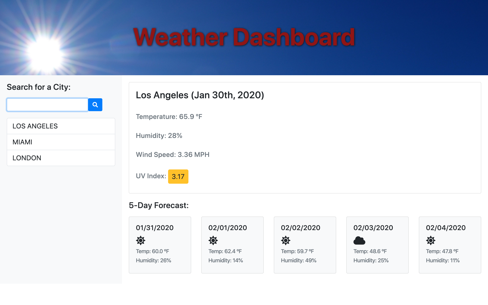

# Weather Dashboard

Deployed site: https://inorrmann.github.io/Weather-Dashboard/

## Need to make plans for the weekend?

With this weather app you can look up any city and get the current temperature, humidity, wind speed, and UV index, as well as a five-day forecast.

## Technologies used

HTML - CSS - Bootstrap - Javascript - JQuery - Open Weather API